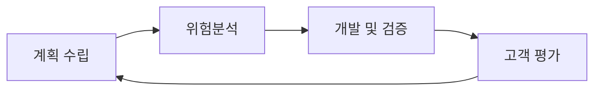

# 요구사항 확인
## (1) 소프트웨어 생명 주기
### 소프트웨어 생명주기(Software Life Cycle)
- 소프트웨어를 개발하기 위한 설계, 운용, 유지보수 등의 과정을 각 단계별로 나눈 것
- 생명주기 모형
  - 폭포수 타입
  - 프로토타입 모형
  - 나선형 모형
  - 애자일 모형

### 폭포수 모형 (Waterfall Model)
- 각 단계를 확실히 매듭짓고 결과를 철저히 검토하여 승인과정을 거친 후 다음 단계를 진행하는 개발 방법론
- 가장 오래되고 가장 폭넓게 사용
- 고전적 생명 주기 모형
- 모형을 적용한 경험과 성공 사례가 많음
- 각 단계가 끝난 후에는 다음 단계를 수행하기 위한 결과물이 명확하게 산출되어야함

### 프로토타입 모형 (Prototype Model, 원형 모형)
- 실제 개발될 소프트웨어에 대한 견본품을 만들어 최종 결과물을 예측하는 모형
- 견본품은 사용자와 시스템 사이 인터페이스에 중점을 둔다.

### 나선형 모형 (Spiral Model, 점진적 모형)
- 여러번의 소프트웨어 개발 과정을 거쳐 점진적으로 개발하는 모형
- 보햄(Bohem)이 제안
- 폭포수 모형과 프로토타입 모형의 장점에 위험 분석 기능을 추가한 모형
- 누락되거나 추가된 요구사항을 첨가할 수 있다.
- 유지보수 과정이 필요 없다.
- 계획하고 분석한 후 개발하고 평가한다.

### 애자일 모형 (Agile Model)
- 요구사항 변화에 대응할 수 있도록 일정한 주기를 반복하면서 개발하는 모형
- 좋은것을 빠르고 낭비없게 하기 위해 고객과의 소통에 초점을 맞춘 방법론
- 폭포수 모형과 대조적
- 기업 활동 전반에 사용
- 대표적인 개발 모형
  - 스크럼
  - XP
  - 칸반
  - Lean
  - 기능 중심 개발

### 애자일 개발 4가지 가치
- 프로세스와 도구보다 개인과 상호작용에 가치를 둠
- 문서보다 실행되는 SW에 가치를 둠
- 고객과 협업에 가치를 둠
- 변화에 대응하는 것에 더 가치를 둠

### 소프트웨어 공학
- 소프트웨어의 위기를 극복하기 위한 방안으로 연구된 학문
- 여러 방법으로 소프트웨어의 품질과 생산성 향상을 목적으로 함
- 기본 원칙
  - 개발된 소프트웨어 품질 유지 -> 지속적 검증
  - 프로그래밍 기술을 계속적으로 적용
  - 소프트웨어 개발 관련 사항 및 결과에 대한 명확한 기록을 유지

## 스크럼 기법
### 스크럼 (Scrum)
- 팀이 중심이되어 개발의 효율성을 높임
- 스스로가 스크럼을 구성하고, 개발 작업에 관한 모든 것을 스스로 해결할 수 있어야함

### 스크럼 팀
| 구성원 | 역할 |
|-|-|
|제품책임자 (PO)| - 요구사항이 담긴 백로그를 작성하는 주체    - 이해관계자들 중 개발될 제품에 대한 이해도가 높고, 요구사항을 책임지고 의사를 결정|
|스크럼 마스터 | - 스크럼 팀이 스크럼을 잘 수행할 수 있도록 가이드를 수행|
|개발팀| - 제품책임자와 스크럼 마스터를 제외한 모든 팀원으로 제품 개발을 수행함|

### 스크럼 개발 프로세스
| 프로세스 | 내용 |
|-|-|
|스프린트 계획 회의| 제춤 백로그 중 이번 스프린트에서 수행할 작업을 대상으로 단기일정을 수립|
|스프린트| 실제 개발작업을 진행하는 과정으로, 보통 2~4주 정도의 기간 내에서 진행|
|일일 스크럼 회의|모든 팀원이 매일 약속된 시간에 15분간 진행상황을 점검하는 회의 남은 작업시간은 소멸차트에 표시|
|스프린트 검토 회의| 부분 또는 전체 완성 제품이 요구사항에 잘 부합하는지 테스팅하는 회의|
|스프린트 회고| 정해놓은 규칙 준수 여부 및 개선 점을 확인하고 기록|

**제품 백로그(Product Backlog)**: 제품 개발에 필요한 모든 요구사항을 우선순위에 따라 나열한 목록. 개발 과정에서 도출되는 요구사항으로 계속 업데이트. 제품 백로그에 작성된 사용자 스토리는 전체 일정 계획인 릴리즈 계획을 수립할 때 사용

**소멸차트(Burn-down Chart)**: 스프린트에서 작업의 진행사항을 확인할 수 있도록 시간의 경과에 따라 남은 작업 시간을 그래프로 표현

- 스크럼 개발을 진행할 때는 계획하여 진행한 후 회의와 검토를 거쳐 회고한다.

### XP(eXtreme Programing) 기법
XP(eXtreme Programming)
- 수시로 발생하는 고객의 요구사항에 유연하게 대응하기 위해 고객의 참여와 개발 과정의 반복을 극대ㅘ하여 개발 생산성을 높이는 방법
- 짧고 반복적, 단순한 설계
- 릴리즈 기간을 짧게 반복하며 요구사항 반영
- XP의 5대 핵심 가치 
  - 의사소통(Communication)
  - 단순성(Simplicity)
  - 용기(Courage)
  - 존중(Resoect)
  - 피드백(Feedback)

### XP 개발 프로세스
|프로세스| 내용 |
|-|-|
|릴리즈 계획 수립| - 부분 혹은 전체 개발 완료 시점에 대한 일정을 수립하는것   - 몇 개의 스토리가 적용되어 부분적으로 기능이 완료된 제품을 제공하는 것을 릴리즈라고함|
|이터레이션|실제 개발 작업을 진행하는 과정으로 보통 1~3주 정도의 기간으로 진행|
|승인 검사| 하나의 이터레이션 안에서 부분 완료 제품이 구현되면 수행하는 테스트|
|소규모 릴리즈|요구사항에 유연하게 대응할 수 있도록 릴리즈의 규모를 축소한 것|

계획하고 진행한 후 검사하고 출시한다.

### XP 주요 실천 방법
|실천 방법| 내용 |
|-|-|
|Piar Programming| 다른 사람과 함께 프로그래밍을 수행함으로써 개발에 대한 책임을 공동으로 나눠가지는 환경을 조성|
|Collective Ownership| 개발 코드에 대한 궈한과 책임을 공동으로 소유함|
|Test-Driven Development| - 개발자가 실제 코드를 작성하기 전에 테스트 케이스를 먼저 작성, 자신이 짜야하는 코드가 무엇인지 정확히 파악   - 테스트가 지속적으로 진행될 수 있도록 자동화된 테스팅 도구|
|Whole Team| 개발에 참여하는 모든 구성원들은 각자 자신의 역할이 있고 그 역할에 대한 책임을 가져야함|
|Continuous Integration| 모듈 단위로 나눠서 개발된 코드들은 하나의 작업이 마무리될 때마다 지속적으로 통합|
|Refactoring| - 프로그램 기능의 변경없이 시스템을 재구성함   - 목적 : 프로그램을 쉽게 이해하고 쉽게 수정하여 빠르게 개발할 수 있도록 함|
|Small Release| 릴리즈 기간을 짧게 반복함으로써 고객의 요구 변화에 신속히 대응|

## 현행 시스템 파악
### 현행 시스템 파악 절차
|프로세스|현행 시스템| 내용 |
|-|-|-|
|1단계|시스템 구성 파악|조직의 주요업무를 담당하는 기간업무와 이를 지원하는 지원 업무로 구분하여 기술|
| |시스템 기능 파악| 현재 제공하는 기능들을 주요, 하부, 세부로 구분하여 계층형으로 표시|
| |시스템 인터페이스 파악| 단위 업무 시스템간에 주고받는 데이터의 종류, 형식, 프로토콜, 연계유형, 주기 등을 명시|
|2단계|아키텍처 구성 파악|최상위 수준에서 계층별로 표현한 아키텍처 구성도를 작성|
| |소프트웨어 구성 파악|소프트웨어의 제품명, 용도, 라이선스 적용방식, 라이선스 수 등을 명시
|3단계|하드웨어 구성 파악| 단위업무 시스템들이 운용되는 서버의 사양, 수량, 이중화 적용여부 명시|
| | 네트워크 구성 파악 | 서버의 위치, 서버간의 네트워크 연결방식을 네트워크 구성도로 작성 | 
